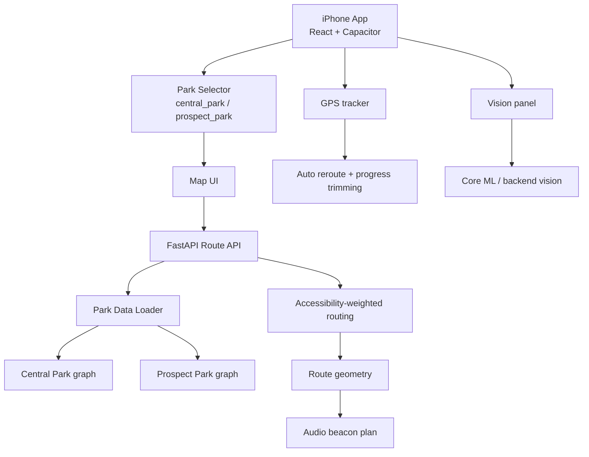

# NYC Park Accessible Navigator

An iOS-first accessible navigation prototype for blind and low-vision walkers in
New York City parks. The app now supports a multi-park structure with Central
Park and Prospect Park sharing the same routing, GPS, audio beacon, reroute, and
vision-fusion logic.

> Prototype only. Not for real navigation or safety-critical use.

## Parks

| Park | Data folder | Status |
| --- | --- | --- |
| Central Park | `data/app_data/` | Full existing graph data |
| Prospect Park | `data/prospect_park_app_data/` | OpenStreetMap/Overpass walkable graph with water restricted areas |

The frontend has a compact park selector in the top bar. Switching parks clears
the active route, reloads that park's nodes/edges, and keeps the same navigation
rules.

## Core Features

- Google Maps-style compact iPhone UI
- Click/tap start and destination selection
- Walkable graph routing through FastAPI
- Continuous GPS tracking once GPS is enabled
- Automatic reroute from the user's current position
- Passed route segments and passed beacons hidden during navigation
- Short voice prompts, audio beacon, vibration, and arrival cues
- Vision panel can run while map navigation continues
- Local Core ML vision packages remain bundled for iPhone testing

## Architecture



## Backend API

The map endpoints accept `park_id`:

```text
GET  /api/parks
GET  /api/nodes?park_id=central_park
GET  /api/edges?park_id=prospect_park
POST /api/route
POST /api/chat
```

Route and chat request bodies also include:

```json
{
  "park_id": "prospect_park"
}
```

## Local Web Run

```bash
cd backend
python3 -m venv .venv
source .venv/bin/activate
pip install -r requirements.txt
uvicorn app.main:app --reload --host 127.0.0.1 --port 8000
```

```bash
cd frontend
npm install
npm run dev
```

Open:

```text
http://127.0.0.1:5173
```

## iOS Build

```bash
cd frontend
npm install
npm run build
npx cap sync ios
open ios/App/App.xcodeproj
```

In Xcode, select a simulator or iPhone, then run the `App` scheme. The visible
app name is now **NYC Park**. The bundle identifier was intentionally left
unchanged to avoid creating new signing/provisioning problems.

## Prospect Park Data

The project includes:

```text
scripts/generate_prospect_park_data.py
data/prospect_park_app_data/
```

Run this when internet access is available to refresh the OpenStreetMap/Overpass
walkable graph and water restricted areas:

```bash
/opt/anaconda3/bin/python3 scripts/generate_prospect_park_data.py
```

If Overpass is unavailable, the script falls back to a conservative offline
seed graph so the app can still test multi-park UI and route plumbing. The
checked-in Prospect Park data is generated from Overpass, not the seed graph.

## Verification

Latest checked locally:

- Python backend compile passed
- Central Park strict route passed
- Prospect Park strict route passed with Overpass graph
- Prospect Park Lullwater sample route avoids non-bridge water crossings
- `npm run build` passed
- `npx cap sync ios` passed using Node 24
- `xcodebuild ... CODE_SIGNING_ALLOWED=NO build` passed

## Data Notes

The algorithms did not fork for Prospect Park. Both parks use the same:

- walkable graph route computation
- accessibility edge weighting
- temporary beacon generation
- GPS arrival/reroute logic
- map + vision fusion contract
