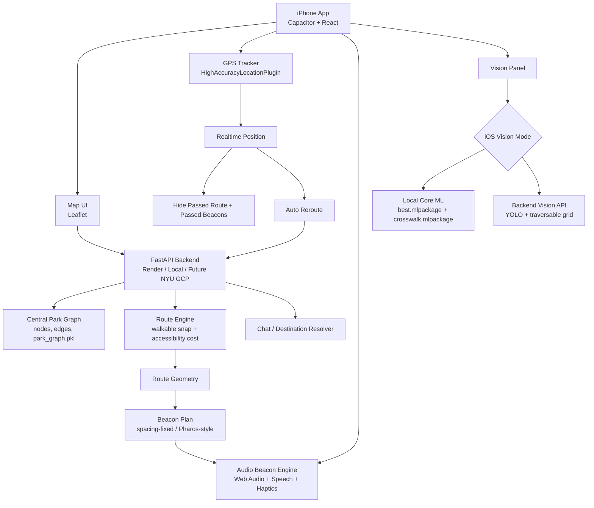
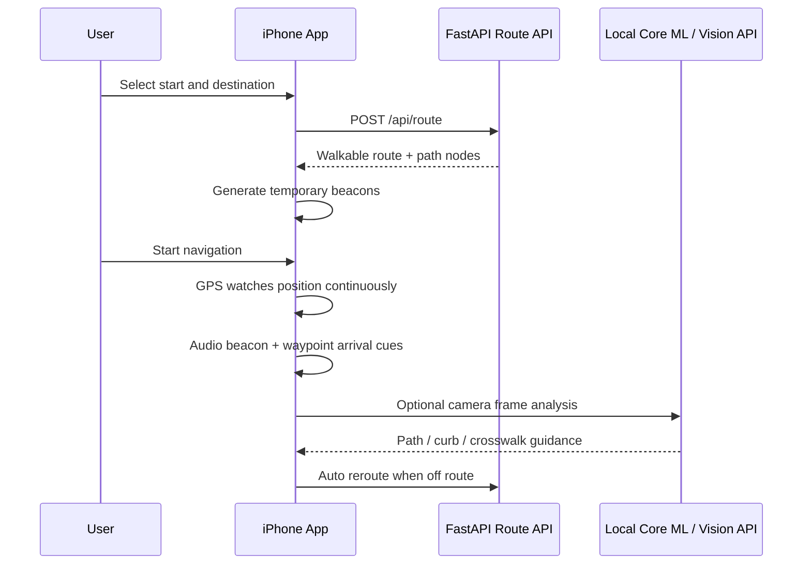

# Central Park Accessible Navigator

An iOS-first navigation prototype for blind and low-vision walkers in Central
Park. The app combines a Google Maps-style route interface, GPS rerouting,
audio beacon navigation, haptic/audio cues, and an experimental on-device
computer vision panel for path, curb, road, sidewalk, and crosswalk awareness.

> Prototype only. Not for real navigation or safety-critical use.

## Project Snapshot

| Map + Audio Navigation | On-Device / Backend Vision |
| --- | --- |
| Route generation over Central Park walkable paths | YOLO segmentation for sidewalk, road, curb, and crosswalk |
| Temporary route beacons and Pharos-style spacing | Core ML iPhone inference with backend fallback |
| Continuous GPS tracking and automatic reroute | 3x7 traversable-space score grid |
| Short voice prompts, audio beacons, and vibration | Bounding boxes, masks, open-path direction, and warnings |

## Visual Examples

The current vision stack is built around path-like segmentation, curb warning,
and crosswalk awareness.

| Open Path / Sidewalk Input | Crosswalk Input |
| --- | --- |
|  |  |

## Architecture



## Current App Flow



## Main Features

- **Google Maps-style compact UI**: map-first interface with draggable bottom
  drawers for route and navigator controls.
- **Walkable route generation**: backend snaps user-selected points to Central
  Park walkable graph data and avoids restricted areas such as the zoo.
- **Continuous GPS navigation**: GPS stays active after GPS is toggled on; the
  locate button is used for recalibration, not one-time tracking.
- **Automatic reroute**: if the user moves away from the current route, the app
  can request a new route from the current position to the destination.
- **Route progress trimming**: passed route segments and passed beacons are
  hidden while navigation continues.
- **Audio beacon navigation**: route beacons trigger short sound, speech, and
  vibration cues. Beacon arrival is based on GPS distance, not phone tilt.
- **Vision-map fusion**: map routing stays active while the camera panel runs;
  vision provides immediate left/right/front safety context.
- **On-device Core ML vision**: iPhone can run the included Core ML model
  packages for offline camera analysis.
- **Backend vision fallback**: the FastAPI backend can analyze static frames
  using YOLO and the same traversable-space scoring logic.

## Repository Layout

```text
.
├── backend/
│   ├── app/main.py
│   ├── app/routers/
│   ├── app/services/routing.py
│   └── app/services/vision/
├── data/app_data/
│   ├── final_candidate_nodes_gridcoded.geojson
│   ├── augmented_graph_edges.geojson
│   └── park_graph.pkl
├── frontend/
│   ├── src/
│   ├── public/vision_coreml/
│   ├── dist/
│   └── ios/App/App.xcodeproj
├── scripts/
├── notebooks/
├── sidewalk.jpg
└── crosswalk.jpg
```

## Backend Routes

The map module still uses a FastAPI backend for route and data APIs.

```text
GET  /api/health
GET  /api/nodes
GET  /api/edges
POST /api/route
POST /api/chat
GET  /api/vision/health
POST /api/vision/analyze-frame
POST /api/vision/analyze-crosswalk
```

For the iPhone build, the current bundled web app can point to Render or a
local backend depending on `VITE_API_BASE_URL` at build time.

## Quick Start: Web Preview

Start the backend:

```bash
cd backend
python3 -m venv .venv
source .venv/bin/activate
pip install -r requirements.txt
uvicorn app.main:app --reload --host 127.0.0.1 --port 8000
```

Start the frontend:

```bash
cd frontend
npm install
npm run dev
```

Open:

```text
http://127.0.0.1:5173
```

Health check:

```bash
curl http://127.0.0.1:8000/api/health
```

## Quick Start: Xcode / iPhone

Build the web bundle and sync it into iOS:

```bash
cd frontend
npm install
npm run build
npx cap sync ios
npx cap open ios
```

In Xcode:

1. Open `frontend/ios/App/App.xcodeproj`.
2. Select the `App` scheme.
3. Select a simulator or a real iPhone.
4. For a real iPhone, set a unique Bundle Identifier under Signing &
   Capabilities.
5. Run.

If using a local backend from a real iPhone, build with the Mac LAN IP:

```bash
VITE_API_BASE_URL=http://192.168.x.x:8000 npm run build
npx cap sync ios
```

If using Render:

```bash
VITE_API_BASE_URL=https://central-park-website-ai-upgrade.onrender.com/api npm run build
npx cap sync ios
```

## Vision Modes

The Vision panel has three engine choices:

| Mode | Meaning |
| --- | --- |
| Auto | Try iPhone Core ML first, then backend fallback |
| Local Core ML | Force offline iPhone inference |
| Backend | Send frames to FastAPI vision endpoints |

Core ML packages are bundled here:

```text
frontend/public/vision_coreml/best.mlpackage
frontend/public/vision_coreml/crosswalk.mlpackage
frontend/ios/App/App/public/vision_coreml/
```

The native iOS bridge lives here:

```text
frontend/ios/App/CapApp-SPM/Sources/CapApp-SPM/LocalVisionPlugin.swift
frontend/ios/App/CapApp-SPM/Sources/CapApp-SPM/HighAccuracyLocationPlugin.swift
frontend/ios/App/App/MainViewController.swift
```

## Vision Logic

The backend and iOS model path share the same idea:

1. Detect semantic masks / boxes for sidewalk, road, curb, and crosswalk.
2. Reconstruct or combine masks into a traversable-space representation.
3. Score the lower camera frame with a 3x7 grid.
4. Prefer a clear center path but allow left/right guidance.
5. Warn for curb up/down and no-path conditions.
6. Return short, action-oriented guidance.

Important output fields:

```text
traversable.best_direction
traversable.raw_scores
traversable.adjusted_scores
curb_warning
crosswalk_guidance
guidance_text
boxes
contours
```

## Audio Beacon Logic

The map module generates temporary beacons after a route is returned. The
spacing-fixed version keeps beacon density practical while still covering turns
and decision points.

The app uses:

- route geometry from `/api/route`
- temporary route beacons
- GPS distance to detect beacon arrival
- short sound cues and vibration
- speech only for concise navigation prompts
- vision left/right/front cues for local safety context

## Deployment Recommendation

Short term:

```text
Render or local Mac backend for map routing
iPhone Core ML for realtime vision when possible
Backend YOLO only as fallback / testing
```

Long term:

```text
NYU Research Cloud / GCP for stable FastAPI backend
NYU Torch HPC for model experiments and conversion
Optional Cosmos-style VLM service for low-frequency scene reasoning
```

Do not put a large model such as Cosmos directly into the realtime route loop.
It should be a separate, low-frequency semantic service if added later.

## Data Requirements

The route backend expects exported Central Park graph files in:

```text
data/app_data/
```

Required:

```text
final_candidate_nodes_gridcoded.geojson
augmented_graph_edges.geojson
park_graph.pkl
app_manifest.json
restricted_areas/central_park_zoo.geojson
```

The current repository includes these files so the backend can run without
regenerating notebook outputs.

## Useful Commands

Run backend:

```bash
cd backend
uvicorn app.main:app --reload --host 127.0.0.1 --port 8000
```

Run frontend:

```bash
cd frontend
npm run dev
```

Build iOS bundle:

```bash
cd frontend
npm run build
npx cap sync ios
```

Run Xcode build check:

```bash
xcodebuild \
  -project frontend/ios/App/App.xcodeproj \
  -scheme App \
  -destination 'generic/platform=iOS Simulator' \
  CODE_SIGNING_ALLOWED=NO \
  build
```

Test vision API:

```bash
curl http://127.0.0.1:8000/api/vision/health
python scripts/test_vision_api.py --mode crosswalk crosswalk.jpg
python scripts/test_vision_api.py --mode open_path sidewalk.jpg
```

## Safety Note

This is a research prototype for accessible outdoor navigation. It should not
be used as the only navigation aid for blind or low-vision users. Real-world
testing should include a sighted guide, controlled routes, and clear informed
consent.
